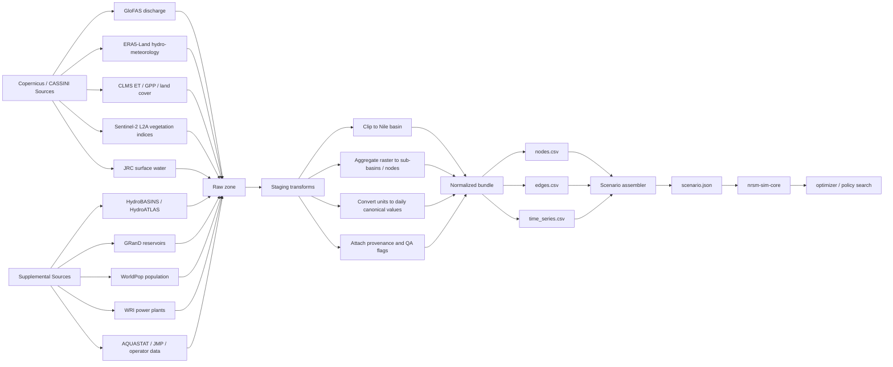

# Nile Dataloader Plan

## Goal

Build a dedicated Rust dataloader layer that ingests CASSINI-friendly Copernicus data plus a few practical supplements, then emits a normalized bundle the simulator and later optimizer can consume without knowing anything about the original sources.

For hackathon speed, the first contract should be simple:

- `nodes.csv`
- `edges.csv`
- `time_series.csv`

That gives us a clean split:

- loaders pull and normalize Earth observation and reference data
- assemblers convert normalized data into scenario-ready simulator inputs
- simulator stays focused on river routing, storage, allocation, and scoring

## Why This Fits CASSINI

The official CASSINI hackathon toolkit points participants to Copernicus Data Space notebooks, cloud infrastructure, and thematic datasets through the Copernicus Data Space Ecosystem. That makes Copernicus-first sourcing a good default for the hackathon, with supplements only where Copernicus does not fully cover basin topology, dams, or population demand.

## Recommended Dataset Stack

| Need | Primary source | Why it fits | Normalized output |
| --- | --- | --- | --- |
| Basin and sub-basin topology | HydroBASINS / HydroATLAS | Gives nested sub-basins and upstream/downstream connectivity for graph design | `nodes.csv`, `edges.csv` |
| River inflow and discharge baselines | Copernicus GloFAS v4.0 | Global daily river discharge at about 0.05 degree resolution; strong fit for Nile headwater and routing inflow proxies | `time_series.csv` with `metric=discharge_m3s` |
| Rainfall, runoff, ET, soil moisture | ERA5-Land | Good gridded hydromet fallback for gap-filling and demand estimation | `time_series.csv` with `precipitation_mm`, `runoff_mm`, `evapotranspiration_mm` |
| Crop water use and vegetation productivity | CLMS evapotranspiration, GPP/NPP/DMP, Sentinel-2 L2A | Good Copernicus backbone for irrigation demand and crop-response proxies | `time_series.csv` with `crop_et_mm`, `gpp_gcm2d`, `ndvi`, `lai`, `irrigation_proxy_mcm_per_day` |
| Surface water extent and seasonality | JRC Global Surface Water | Useful for wetland and floodplain masking and reach sanity checks | node metadata and QA masks |
| Reservoir and dam metadata | GRanD plus official dam/operator data where available | Needed because reservoir operating constraints are not fully covered by Copernicus alone | `nodes.csv` static fields |
| Hydropower assets and capacity | WRI Global Power Plant Database plus dam operator data | Good initial plant inventory and capacity lookup | `nodes.csv` static fields, `time_series.csv` targets if available |
| Drinking-water demand proxy | WorldPop plus JMP/AQUASTAT country ratios | Gives spatial population exposure and country-level water-service context | `time_series.csv` with `drinking_demand_mcm_per_day` |

## Key Research Notes

- CASSINI's official tools page explicitly routes teams to Copernicus Data Space notebooks and cloud infrastructure for hackathon work.
- GloFAS v4.0 provides daily global discharge maps at 0.05 degrees, which is a strong base layer for Nile inflow estimation and calibration.
- ERA5-Land documents actual evapotranspiration and potential evaporation, and exposes them under the evaporation and runoff category.
- CLMS provides global evapotranspiration at 300 m and 10-daily frequency, plus land cover and vegetation productivity products that are useful for crop-water proxies.
- Sentinel-2 Level-2A provides atmospherically corrected surface reflectance and scene classification, which makes it a good source for NDVI-style agricultural indicators.
- HydroBASINS gives globally consistent nested sub-basins plus topology-friendly coding.

## Canonical Units

Pick one canonical unit system early and enforce it in the dataloader:

- Water flow and demand: `million_m3_per_day`
- Storage: `million_m3`
- Energy: `MWh_per_day`
- Crop output proxy: `tonnes_per_day`
- Area layers: `km2`
- Raster climate variables before conversion: keep source units in raw/staging, convert only in normalized outputs

This is especially important because Copernicus products mix discharge, depth, energy, and productivity units.

## Standardized Bundle

### `nodes.csv`

One row per model node.

Suggested columns:

| Column | Meaning |
| --- | --- |
| `scenario_id` | scenario or experiment identifier |
| `node_id` | stable machine id |
| `name` | display name |
| `node_kind` | `river` or `reservoir` |
| `latitude` / `longitude` | representative point |
| `country_code` | ISO3 if known |
| `subbasin_id` | HydroBASINS or similar id |
| `reservoir_capacity_million_m3` | optional static storage |
| `reservoir_min_storage_million_m3` | optional static storage floor |
| `initial_storage_million_m3` | scenario start state |
| `food_per_unit_water` | optional crop response coefficient |
| `energy_per_unit_water` | optional hydropower coefficient |
| `notes` | free-text assumptions |

### `edges.csv`

One row per directed reach in the simplified Nile graph.

Suggested columns:

| Column | Meaning |
| --- | --- |
| `scenario_id` | scenario identifier |
| `edge_id` | stable machine id |
| `from_node_id` / `to_node_id` | graph endpoints |
| `flow_share` | downstream share, normally `1.0` unless branching |
| `default_loss_fraction` | evaporation, seepage, or routing loss assumption |
| `travel_time_days` | optional future routing parameter |
| `notes` | assumptions or source |

### `time_series.csv`

One row per metric, entity, and interval.

Suggested columns:

| Column | Meaning |
| --- | --- |
| `scenario_id` | scenario identifier |
| `entity_type` | `node` or `edge` |
| `entity_id` | referenced id |
| `metric` | e.g. `local_inflow`, `drinking_target_delivery`, `glofas_discharge`, `crop_et` |
| `interval_start` / `interval_end` | ISO-8601 dates |
| `value` | canonical numeric value |
| `unit` | canonical or preserved source unit |
| `source_name` | short source label |
| `source_url` | provenance link when known |
| `transform` | aggregation or conversion note |
| `quality_flag` | optional QA signal |

## Visual Flow



## Mapping Into The Current Simulator

The current Rust simulator expects:

- node-local inflow
- optional reservoir release targets
- optional drinking-water demand
- optional irrigation demand
- optional hydropower limits and targets

So the first assembler should map normalized metrics into those model fields:

| Normalized metric | Simulator field |
| --- | --- |
| `local_inflow_million_m3_per_day` | `node.local_inflow` |
| `reservoir_target_release_million_m3_per_day` | `reservoir.target_release` |
| `drinking_minimum_delivery_million_m3_per_day` | `drinking_water.minimum_daily_delivery` |
| `drinking_target_delivery_million_m3_per_day` | `drinking_water.target_daily_delivery` |
| `irrigation_minimum_delivery_million_m3_per_day` | `irrigation.minimum_daily_delivery` |
| `irrigation_target_delivery_million_m3_per_day` | `irrigation.target_daily_delivery` |
| `hydropower_minimum_mwh_per_day` | `hydropower.minimum_daily_energy` |
| `hydropower_target_mwh_per_day` | `hydropower.target_daily_energy` |
| `hydropower_max_turbine_flow_million_m3_per_day` | `hydropower.max_turbine_flow` |

## Suggested Directory Layout

```text
horizon/nrsm/
  data/
    raw/
      glofas/
      era5_land/
      clms/
      sentinel2/
      hydrobasins/
      worldpop/
      grand/
    staging/
    normalized/
  docs/
    nile-dataloader-plan.md
  crates/
    nrsm-dataloader/
```

## First 48-Hour Hackathon Cut

If time is tight, build in this order:

1. Manually define a 6-12 node Nile graph using HydroBASINS and known dams.
2. Pull GloFAS discharge for major inflow points and convert to node `local_inflow`.
3. Use WorldPop plus country-level demand heuristics to create drinking-water targets.
4. Use CLMS ET and land cover to create irrigation-demand proxies for Sudan and Egypt nodes.
5. Use WRI plus operator factsheets to set GERD and Aswan hydropower coefficients and limits.
6. Export monthly 30-day inputs first, then upgrade to daily once the pipeline is stable.

## Rust Boundary Recommendation

Yes: keep the dataloader as its own Rust crate.

Why:

- it isolates external I/O and messy source-specific logic from the simulator
- it gives the optimizer a stable intermediate representation later
- it makes it easy to swap CSV now for Parquet later without touching the sim core

Recommended split:

- `nrsm-dataloader`: source adapters, normalization, CSV bundle writer
- `nrsm-sim-core`: pure simulation model and engine
- future `nrsm-scenario-assembler`: maps normalized bundle to scenario JSON or direct structs

## Sources

- [CASSINI hackathon toolkit](https://www.cassini.eu/hackathons/tools)
- [CASSINI Space for Water event page](https://www.euspa.europa.eu/newsroom-events/events/cassini-hackathon-space-water)
- [GloFAS v4.0 overview](https://www.ecmwf.int/en/about/media-centre/news/2022/copernicus-emergency-management-service-releases-glofas-v40)
- [ERA5-Land documentation](https://confluence.ecmwf.int/display/CKB/ERA5-Land%3A+data+documentation)
- [Copernicus Land Monitoring Service documentation](https://documentation.dataspace.copernicus.eu/Data/CopernicusServices/CLMS.html)
- [Sentinel-2 documentation](https://documentation.dataspace.copernicus.eu/Data/SentinelMissions/Sentinel2.html)
- [JRC surface water overview](https://wad.jrc.ec.europa.eu/surfacewater)
- [HydroBASINS](https://www.hydrosheds.org/products/hydrobasins)
- [GRanD database](https://www.thegwsp.org/products/grand-database.html)
- [WorldPop data catalog](https://www.worldpop.org/datacatalog/)
- [Global Power Plant Database](https://www.wri.org/research/global-database-power-plants)
- [FAO WaPOR data](https://www.fao.org/in-action/remote-sensing-for-water-productivity/wapor-data/)
- [FAO AQUASTAT irrigation water use](https://www.fao.org/aquastat/en/data-analysis/irrig-water-use/)
